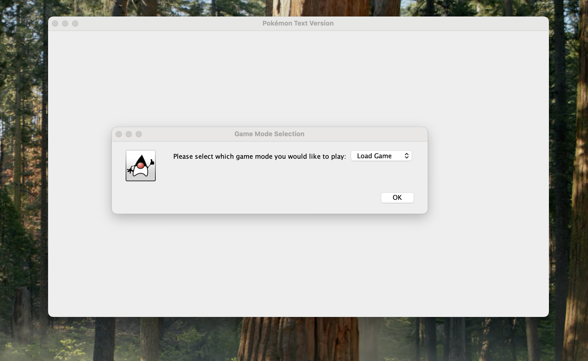
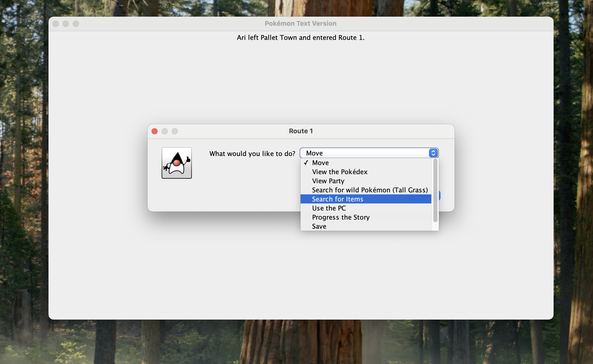
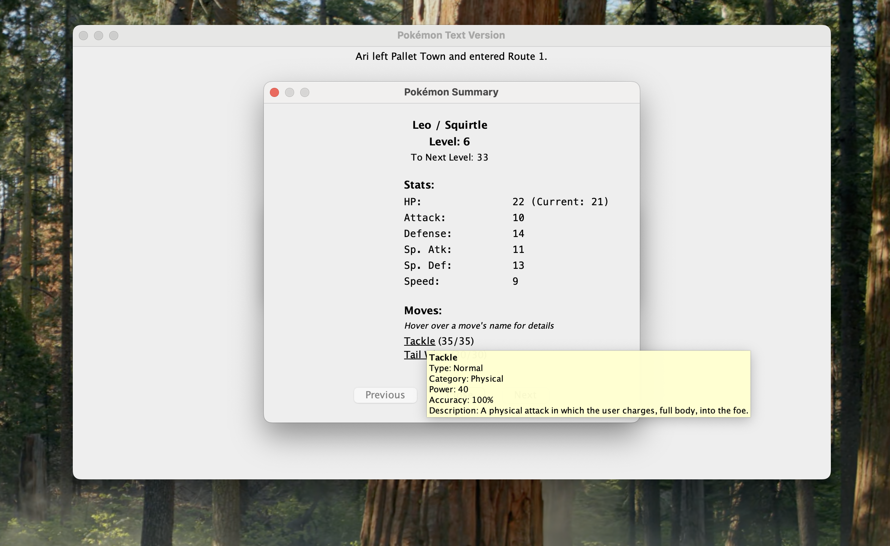
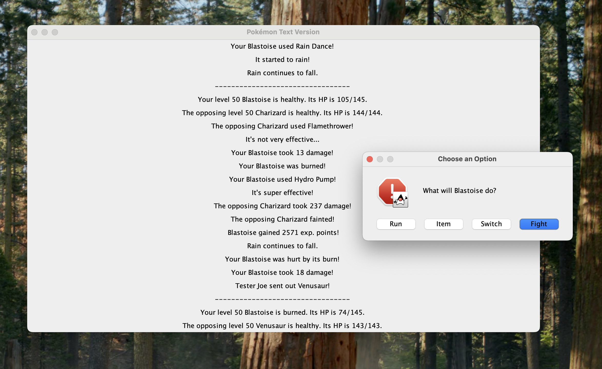

# Pokémon Text Version

A text-based recreation of the classic Pokémon games, implemented in Java. I started this project years ago, and picked it back up recently to use as a code sample for my Java work. I've made numerous improvements, and the game can now be started and played, though there isn't much content to get through. 

## Features

- The classic Pokémon experience, completely done with text -- No pictures of any kind!
- Full implementation of real battle mechanics from the games
- Support for various Pokémon and moves
- Support for multiple save files
- Currently, Adventure Mode goes up to just before the first Gym Battle
- Quick Battle mode to jump into a quick match with high-level Pokémon

## Requirements

- Java 11 or higher
- Maven 3.6 or higher

## Building and Running

1. Clone the repository:
   ```bash
   git clone https://github.com/yourusername/pokemon-text-version.git
   cd pokemon-text-version
   ```

2. Build the project:
   - Using Maven:
     ```bash
     mvn clean install
     mvn compile
     ```
   - Using Gradle:
     ```bash
     ./gradlew build
     ```
   - Using IDE:
     - Import the project as a Maven/Gradle project
     - Build using your IDE's build tools

3. Run the game:
   - From command line:
     ```bash
     java -cp target/classes com.game.GameStarter
     ```
   - From IDE:
     - Run the `GameStarter` class in `src/main/java/com/game/`
    ```

## Project Structure

```
src/
├── main/
│   ├── java/
│   │   ├── actions/    - Game action implementations
│   │   ├── areas/      - Game area implementations
│   │   ├── battle/     - Battle system implementation
│   │   ├── data/       - Data structures and models
│   │   ├── enums/      - Enums for different game mechanics
│   │   ├── events/     - Event system
│   │   ├── exceptions/ - Custom exceptions
│   │   ├── game/       - Infrastructure for actually running the game, loading/saving data
│   │   ├── items/      - Item implementations
│   │   ├── moves/      - Move implementations
│   │   ├── pokémon/    - Pokémon-related classes
│   │   ├── testing/    - Test utilities
│   │   ├── trainer/    - Trainer-related implementations
│   │   ├── ui/         - User interface components
│   │   └── util/       - Utility classes
│   └── resources/
│       ├── data/       - Game data files
```

The most interesting files to look at would probably be:

-- Pokémon.java: An abstract class defining the general Pokémon data structure, with all of the fields and methods needed
-- Game.java: The class that actually runs the game loop
-- Battle.java & DamageCalculator.java: These classes comprise the battle logic and all logic around damage calculation
-- GameFrame.java: The UI for the game.


## Screenshots






## Legal Notice

This is a fan-made project for educational purposes only. Pokémon and all related trademarks belong to Nintendo, Game Freak, and The Pokémon Company. This project is not affiliated with, endorsed, sponsored, or specifically approved by Nintendo, Game Freak, or The Pokémon Company.

This project is intended for non-commercial use under fair use for educational purposes. All Pokémon names, characters, and related indicia are trademarks of their respective owners.

If you are a representative of Nintendo, Game Freak, or The Pokémon Company and have concerns about this project, please contact me and I will address your concerns promptly.

## License


[MIT](https://choosealicense.com/licenses/mit/) (Applies only to original code, not to Pokémon intellectual property) 